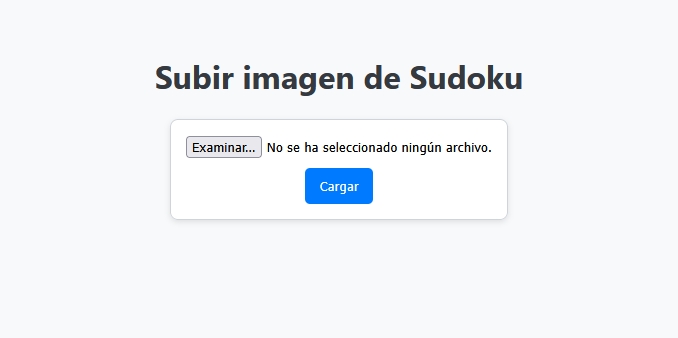
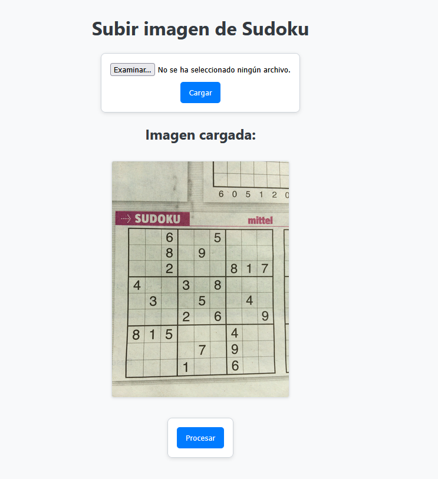
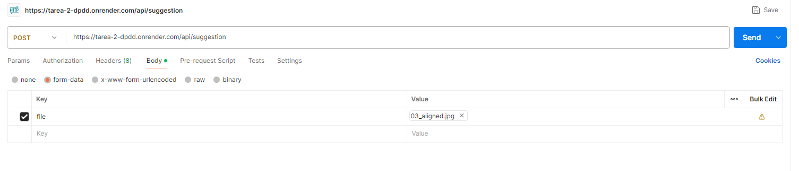

# 🧠 Sugeridor de técnicas de resolución de Sudoku

Este proyecto implementa una aplicación basada en **FastAPI** que permite subir imágenes de tableros de Sudoku, detectarlos mediante **YOLOv8**, reconocer los dígitos con una red **CNN**, y entregar una sugerencia sobre la técnica avanzada que podría aplicarse para continuar resolviendo el Sudoku.

---

## 📖 Descripción

El sistema permite a los usuarios cargar una imagen de un tablero de Sudoku (tomada desde papel, pantalla u otro medio) y realiza el siguiente procesamiento:

1. **Detección del tablero** usando un modelo **YOLOv8 personalizado**.
2. **Transformación de perspectiva** y preprocesamiento de la imagen para segmentar cada celda del tablero.
3. **Clasificación de los números** usando un modelo **CNN entrenado** para reconocer dígitos escritos.
4. **Construcción de la grilla digitalizada** del Sudoku.
5. **Sugerencia de técnica avanzada de resolución** (como XY-Wing, Intersección línea-región, etc.).

Además, se generan visualizaciones intermedias del proceso (detección, contornos, transformación y tablero digitalizado) que se muestran en la aplicación web.

También se expone una API para recibir imágenes y retornar los resultados en formato JSON, útil para integraciones externas.

---

## 🛠 Tecnologías

- Python 3.12.x
- fastapi==0.116.1
- uvicorn==0.35.0
- pydantic==2.11.7
- pillow==11.3.0
- Jinja2==3.1.6
- python-multipart==0.0.20
- numpy==2.1.3
- opencv-python==4.12.0.88
- ultralytics==8.3.173
- matplotlib==3.10.5
- joblib==1.5.1
- scikit-learn==1.7.1
- keras==3.11.1
- tensorflow==2.19.0

---

## 📦 Instalación

1. Clona el repositorio:
   ```cmd
   git clone https://github.com/gabalvarezmc/t2_dppd
   cd sudoku-solver-web
   ```

2. Crea y activa un entorno virtual
   ```cmd
    python -m venv .venv
    .venv\Scripts\activate
   ```

3. Instala las dependencias:
   ```cmd
    pip install -r requirements.txt
   ```

4. Asegúrate de que existan los siguientes archivos en la carpeta models/:
    - yolo_best.pt: modelo entrenado para detección de tableros.
    - model_cnn_numbers.joblib: modelo CNN para reconocimiento de dígitos.

## ▶️ Uso
### 🌐 Interfaz web local

1. Inicia el servidor:
   ```
    uvicorn main:app --reload
   ```

2. Abre tu navegador en:
   ```
    http://localhost:8000
   ```

3. Sube una imagen de un Sudoku y presiona "Procesar" para ver los gráficos intermedios y la sugerencia de técnica.

### 🧪 API REST para Postman u otras apps
- Detalles de API:
    - Endpoint:
    ```
        POST /api/suggestion
    ```
    - Body:
    ```
        file: imagen del Sudoku (form-data). Se permiten jpg, jpeg y png. 
    ```
- Imágenes de ejemplo: Las imágenes se pueden encontrar en la carpeta static/examples/
    - Imagen 1

    
  
    - Imagen 2

    

    - Imagen 3

    


- Ejemplo de respuesta al encontrar tablero:
   ```
    {
        "suggestion": "Naked Single: colocar 5 en columna F, fila 2",
        "status": "ok",
        "sudoku_digitalized": "803000002060480103000100000000000900301004000060702420178509300000000758000267000"
    }
   ```

- Ejemplo de respuesta al NO encontrar tablero:
   ```
    {
        "suggestion": "No se detectó ningún tablero de Sudoku en la imagen.",
        "status": "no_sudoku_detected",
        "sudoku_digitalized": "000000000000000000000000000000000000000000000000000000000000000000000000000000000"
    }
   ```


## 💡 Estructura del proyecto

    sudoku-solver-web/
    ├── main.py
    ├── requirements.txt
    ├── render.yaml
    ├── static/
    │   └── uploads/
    │   └── examples/
    ├── templates/
    │   └── index.html
    ├── models/
    │   ├── yolo_best.pt
    │   └── model_cnn_numbers.joblib
    ├── src/
    │   ├── process_image.py
    │   └── sudoku_solver/
    │       └── main.py
    │       └── techniques
    │           └── basic_techniques.py
    │           └── cadenas_coloreadas.py
    │           └── fish_patterns.py
    │           └── interseccion_linearegion.py
    │           └── naked_subset.py
    │           └── rectangulo_unicidad.py
    │           └── subconjuntos_ocultos.py
    │           └── xy_chain.py
    │           └── xy_wing.py
    │           └── xyz_wing.py

## 💡 Servicio habilitado en Render

IMPORTANTE: El servicio cargado en Render no considera la detección del tablero Sudoku con YOLOv8 debido al alto uso de memoria del modelo y a la configuración de uso gratuito de la plataforma. Esta versión se puede encontrar en la rama de este mismo repositorio de nombre "to_render".

La URL donde se encuentra deplegado el servicio es:
   ```
    https://tarea-2-dpdd.onrender.com/
   ```

El servicio se puede utilizar de dos formas:

### Forma 1: Interfaz HTML

Se puede predecir utilizando el modelo utilizando la interfaz gráfica desarrollada en HTML. Los pasos son los siguientes:

1. Abrir URL del servicio en su ruta base:
   ```
    https://tarea-2-dpdd.onrender.com/
   ```
2. Examinar y seleccionar una fotografía y seleccionar "Cargar".

    

3. Una vez cargado correctamente, seleccionar "Procesar".

    

4. Se pueden observar los resultados de la digitalización y predicción.

    


### Forma 2: API disponible

URL de API:

   ```
    https://tarea-2-dpdd.onrender.com/api/suggestion
    Método POST
   ```

Para probar la API se puede realizar de las siguientes formas:

1. Con código python: Se puede cargar la imagen y hacer un request con el siguiente código.
   ```
    import requests
    image_path = "path_imagen" 
    with open(image_path, "rb") as img_file:
        files = {"file": (image_path, img_file, "image/jpeg")}
        response = requests.post(url, files=files)
        print(response.json())
   ```
2. Desde POSTMAN: Agregar un body de tipo "form-data", configurar una key con nombre "file" y de tipo File y seleccionar la imagen a probar.

    

## 💡 Tests de funcionamiento del servicio

En el notebook de nombre client.ipynb se pueden encontrar los tests realizados para comprobar el funcionamiento del modelo.